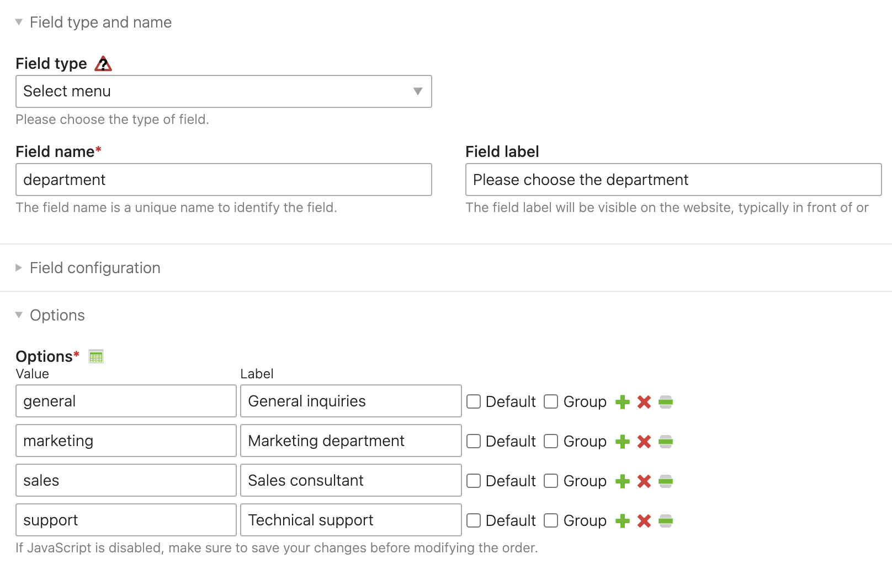
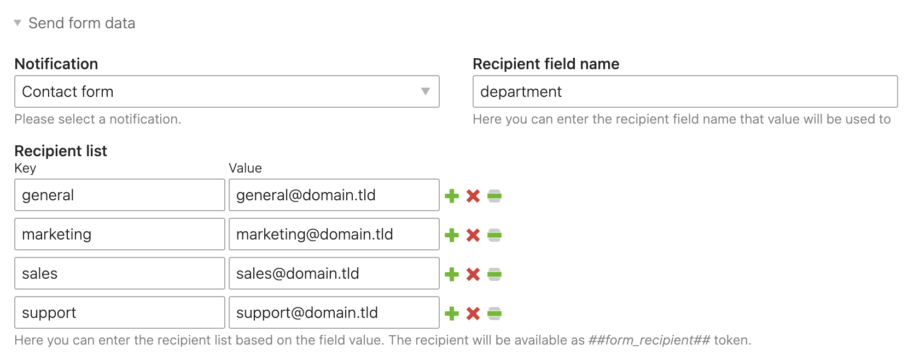

# Dynamic Form Recipient – Documentation

## Create a form field

Create a form field that value will be used to determine the recipient of the form. Note down the `Field name`
and the value of each option – we will need this data in the form settings.

Example:

## Update the form settings

Edit the form settings and navigate to the `Send form data` legend. In the `Recipient field name`, you should enter
the name of the fields you have just created. In the `Recipient list` wizard, you should enter respectively
the form field value (in our case, it's a value of the option) and the corresponding e-mail address.

Example:

From now on, you will be able to use the `##form_recipient##` simple token in your notification.

> Note: if the form field value does not match any recipient, the administrator e-mail will be used as a fallback.
